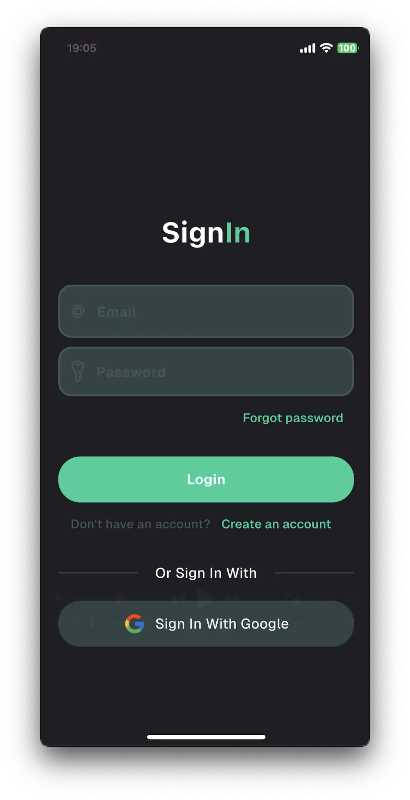
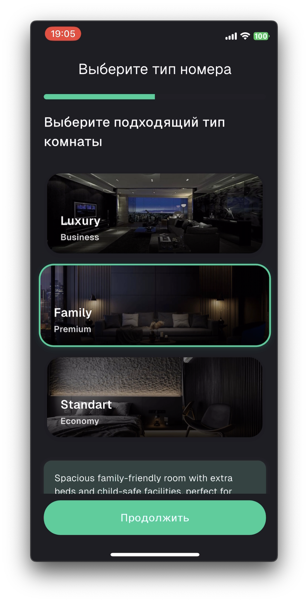
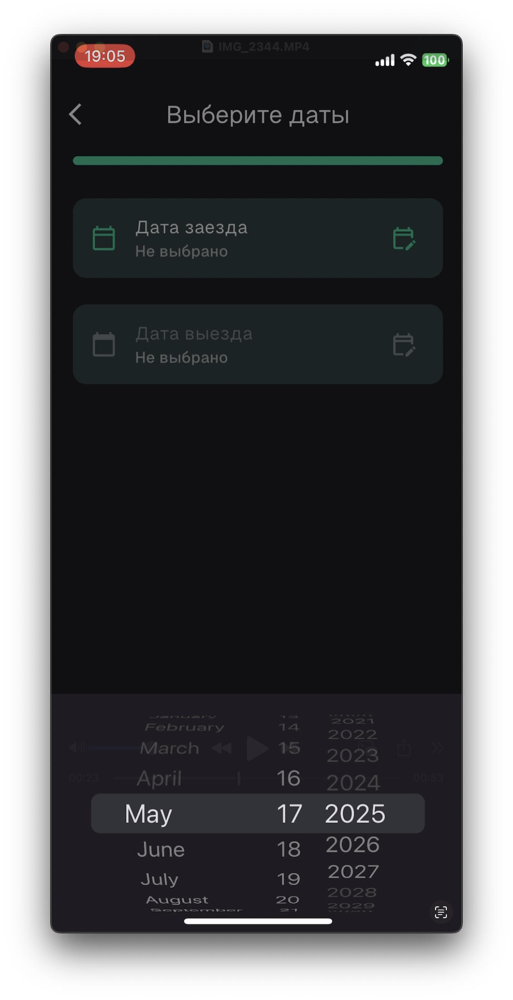
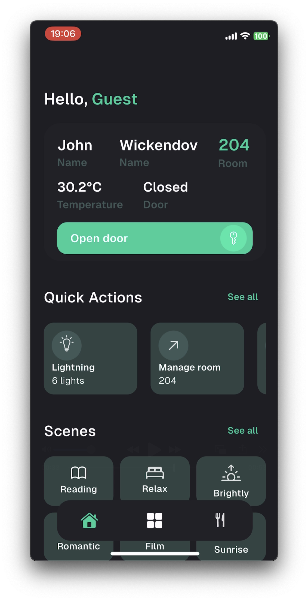
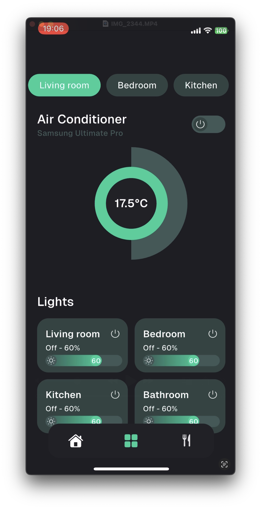
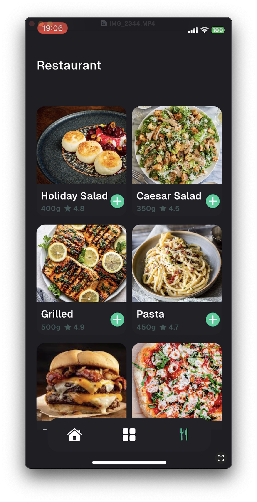

# Smart Hotel App 🏨📱

Welcome to the **Smart Hotel App** — a next-gen mobile solution for smart hotels! This Flutter-powered application leverages **Bluetooth Low Energy (BLE)**, **Protocol Buffers (protobuf)**, and **BLoC architecture** to provide seamless, secure, and real-time room control and guest interaction. 🚪🔐📡

---

## 🚀 Features

* 🔒 **Smart Room Access** — Unlock doors via BLE and protobuf handshake
* 🌡️ **Control Room Environment** — Lights, AC, curtains
* 📶 **BLE Communication** — Custom BLE service with protobuf serialization
* 🧠 **State Management with BLoC** — Scalable and reactive UI
* 🧾 **Room Service Orders** — Request services directly from the app
* 📍 **Indoor Navigation (Planned)** — BLE beacon-based navigation

---

## 🛠️ Tech Stack

| Tech                | Description                        |
| ------------------- | ---------------------------------- |
| Flutter             | Cross-platform UI toolkit          |
| Dart                | Programming language               |
| flutter\_bloc       | State management                   |
| flutter\_blue\_plus | BLE communication                  |
| protobuf            | Lightweight message serialization  |
| Realm DB            | Local database for offline caching |

---

## 📲 Getting Started

1. **Clone the repo:**

```bash
git clone https://github.com/your-org/smart-hotel-app.git
cd smart-hotel-app
```

2. **Install dependencies:**

```bash
flutter pub get
```

3. **Generate protobuf files:**

```bash
protoc --dart_out=lib/proto lib/proto/*.proto
```

4. **Run the app:**

```bash
flutter run
```

---

## 📡 BLE Setup

* Ensure BLE permissions are granted (both Android & iOS)
* Configure GATT service with custom characteristics
* Communication follows a protobuf-encoded protocol

---

## 📁 Project Structure

```bash
lib/
├── blocs/             # BLoC components
├── models/            # Data models (protobuf, internal)
├── services/          # BLE and business logic
├── proto/             # .proto definitions
├── ui/                # Flutter UI widgets and pages
└── main.dart          # Entry point
```

---

## 🖼️ Screenshots

| Screen # | Description              | Image Placeholder            |
| -------- | ------------------------ | ---------------------------- |
| 1        | Login       |  |
| 2        | Registration      |  |
| 3        | Reservation |  |
| 4        | Date time picker       |  |
| 5        | Home Screen       |  |
| 6        | Manage room screen     |  |
| 7        | Restaurant |  |

---

## 📬 Feedback

We’d love to hear from you! Feel free to open issues or submit PRs to improve the app. 🙌

---

## 📄 License

This project is licensed under the MIT License.

---

**Enjoy your stay at the Smart Hotel! 🛏️✨**
